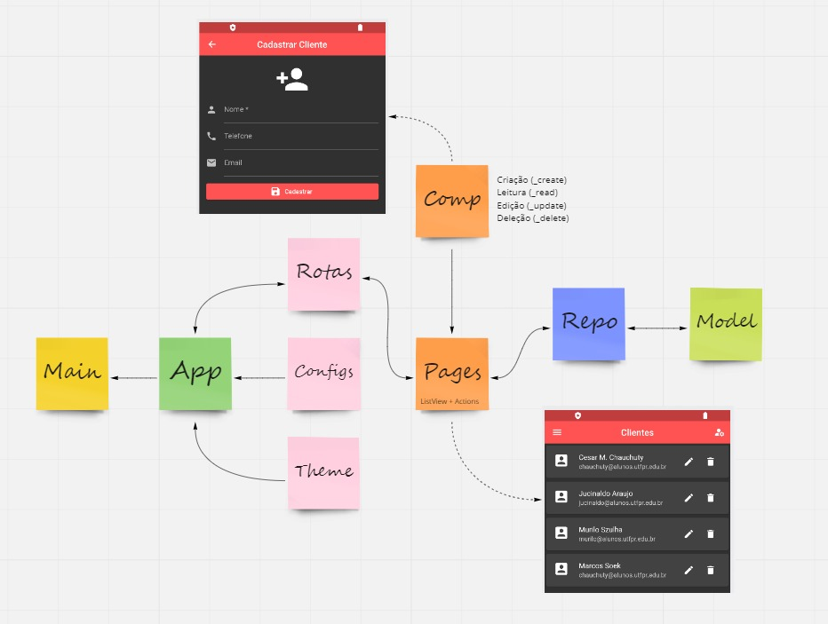
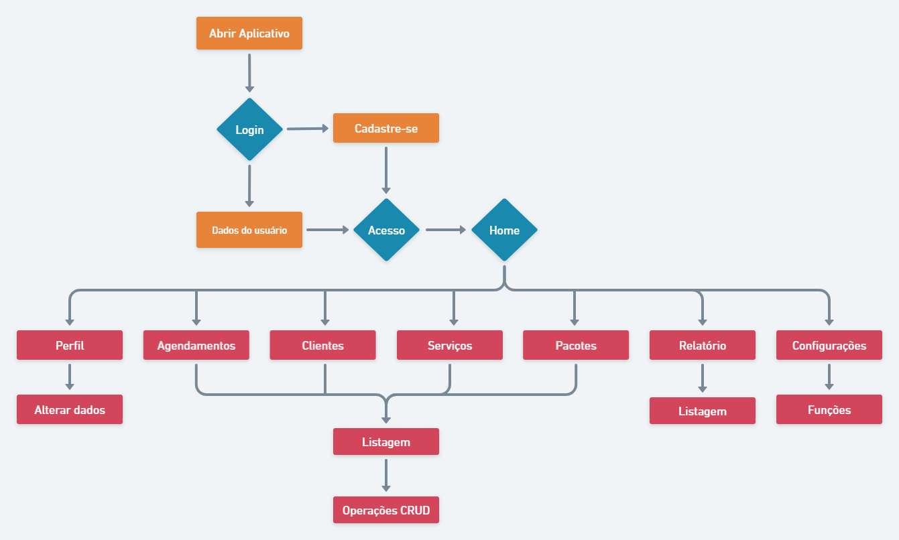

#### Programação de Dispositivos Móveis - UTFPR

#### Integrantes:
  - Cesar Mauricio Chauchuty
  - Jucinaldo Araujo (RA-2296500)
  - Murilo  Szulha
  - Marcos Soek


#### Parte I
- :white_check_mark: Objetivo do Aplicativo
- :white_check_mark: Apresentação do Projeto
- :white_check_mark: Uso de Formulários
- :white_check_mark: Validações e Feedback
- :white_check_mark: Estrutura e Padronização
- :white_check_mark: Navegação entre Páginas
- :white_check_mark: Interface Adequada


### Comando de Instalação
#### Executar os comandos abaixo sequencialmente:

```
git clone https://github.com/chauchuty/projeto-de-software.git
```
```
cd project-de-software
cd flutter_refactoring
flutter run
```
### MVC


### User Flow

