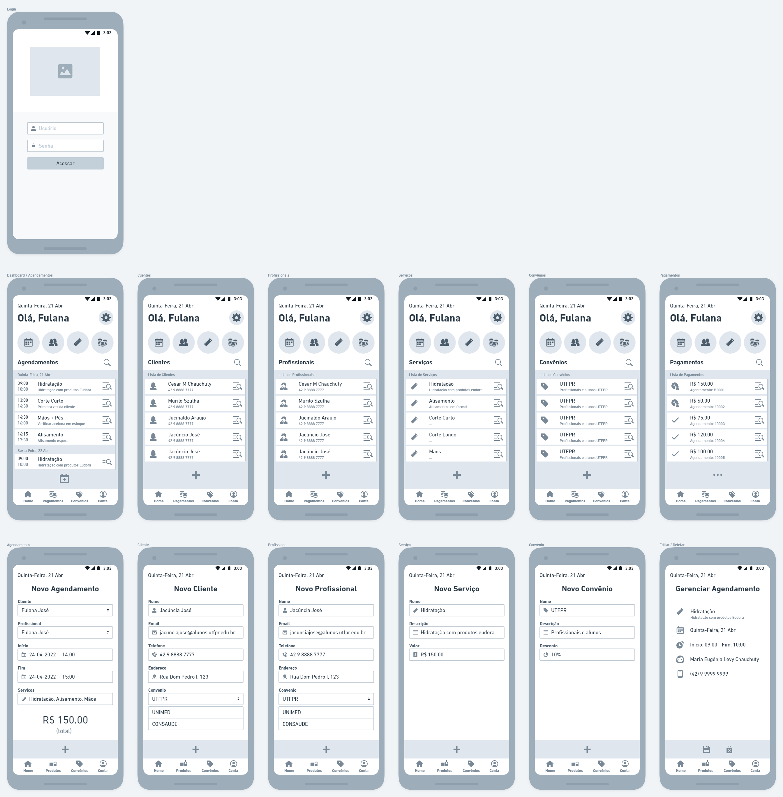
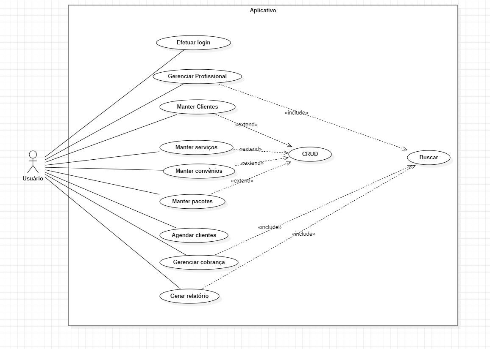

### Projeto de software - UTFPR

#### Gestão de salão de beleza

#### Integrantes:
  - Cesar Mauricio Chauchuty
  - Jucinaldo Araujo
  - Murilo  Szulha

#### Objetivo
Desenvolver um sistema de gestão de salão de beleza, que  permita ao usuário executar as operações CRUD de clientes, serviços e agendamentos.

#### Cronograma

| DATA       |             Descrição            |
|------------|----------------------------------|
| 07/03/2022 | Início do projeto                |
| 07/03/2022 | Escolha da proposta              |
| 07/03/2022 | Pesquisa da temática             |
| 16/03/2022 | Definição das etapas do projeto  |
| 16/03/2022 | Desenvolvimento do protótipo     |
| 26/03/2022 | Desenvolvimento de caso de uso   |
| 26/03/2022 | Desenvolvimento de database      |
| 24/04/2022 | Finalização do protótipo         |

#### Protótipo

#### Use Case

#### Funcionalidades

- Acesso ao sistema de gestão de salão de beleza com validações de login e senha.
- Gestão de Agendamentos
- Gestão de Clientes
- Gestão de Profissionais
- Gestão de Convênios
- Gestão de Serviços
- Consulta de Pagamentos